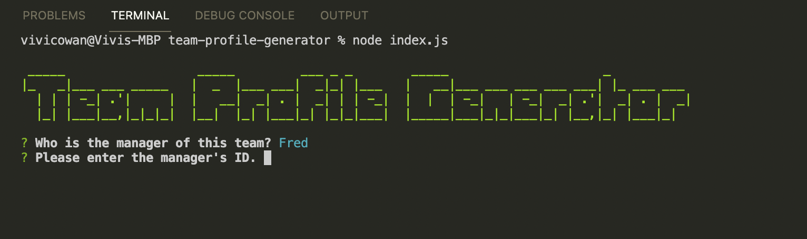
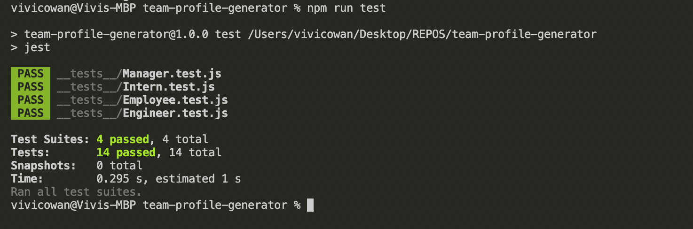

# Team-Profile-Generator

## Description:
- For this task, I wanted to generate a webpage through the command line that displays my team's basic info.  
- The reason I built this team profile generator was to practice Object Oriented Programming and Test Driven Development. I also got to explore the use of npm and node which is what allowed me to make a functional command line.
- This task helped me gain addition experience and practice with OOP and TDD. Learning a new programming paradigm was a bit difficult to understand at first. However with this practice, I am more comfortable coding through objects. 
- This team profile generator helped me realize that seperating classes/objects onto different pages is much more organized than having one page full of confusing code.

## How to run this application
- Team Profile Generator is a command-line application. At the command line, type in "node index.js" to run the application.  The user will be presented with a series of questions related to the team members. The user is to provide all needed information by answering the series of questions. Once the user has answered all questions, the HTML output file using the team name as the file name will be generated under the "dist" folder.

- Inside VS Code, to view the generated html file, right-click the file and choose "Open in Default Browser" from the pop-up menu.

## Instuctional Video
For a demonstration on how to run this application, please watch this video: [Walkthrough](https://youtu.be/BSrrsaSxZSw)

## Images
Command Line:

The generated HTML page:

## Testing
This program was build using class syntax and constructor functions. The function for each employee type was tested before building out the rest of the program. 

